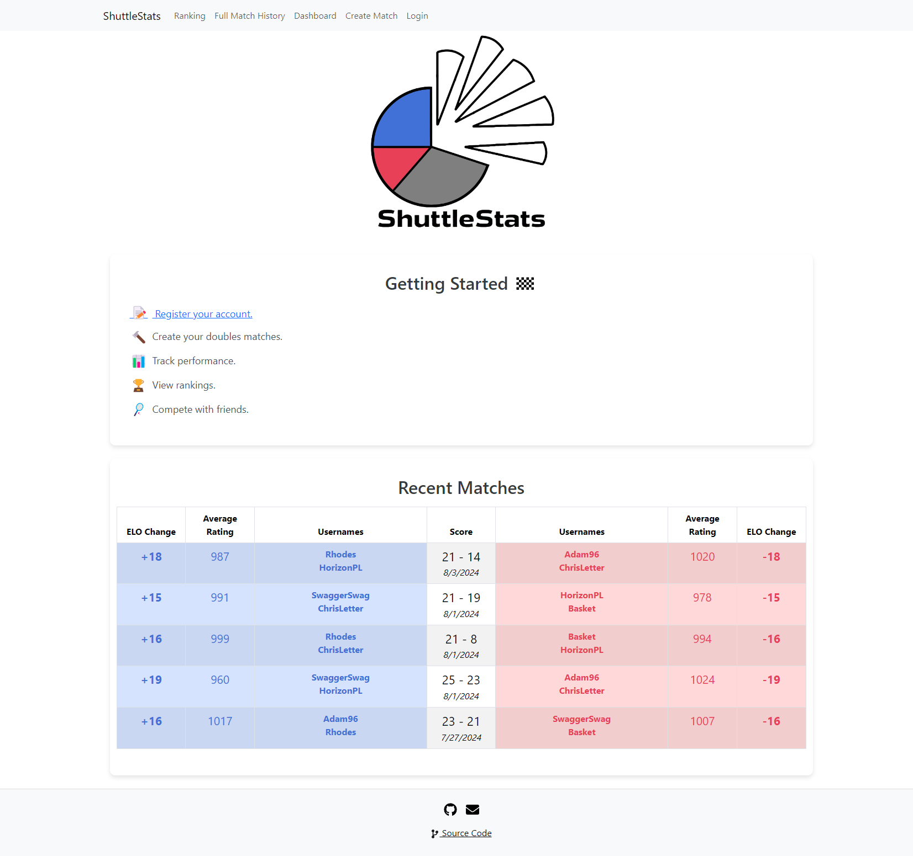
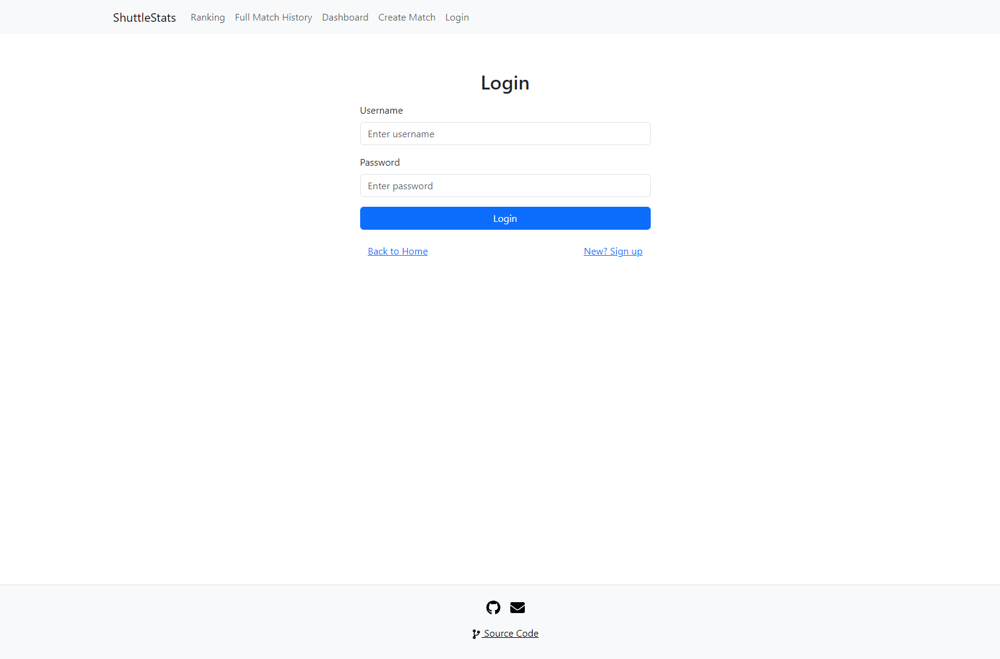
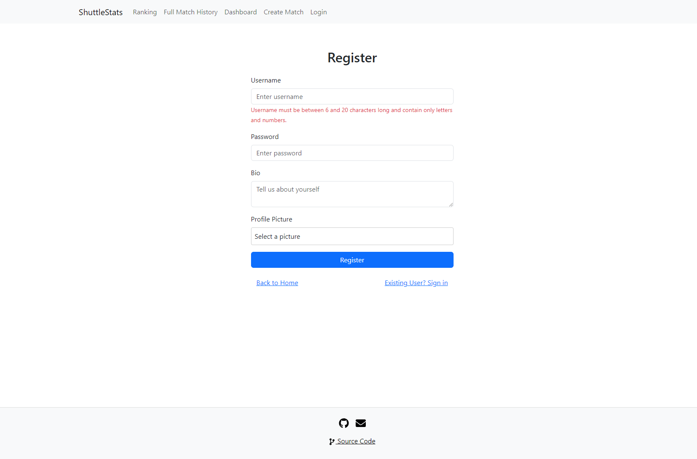
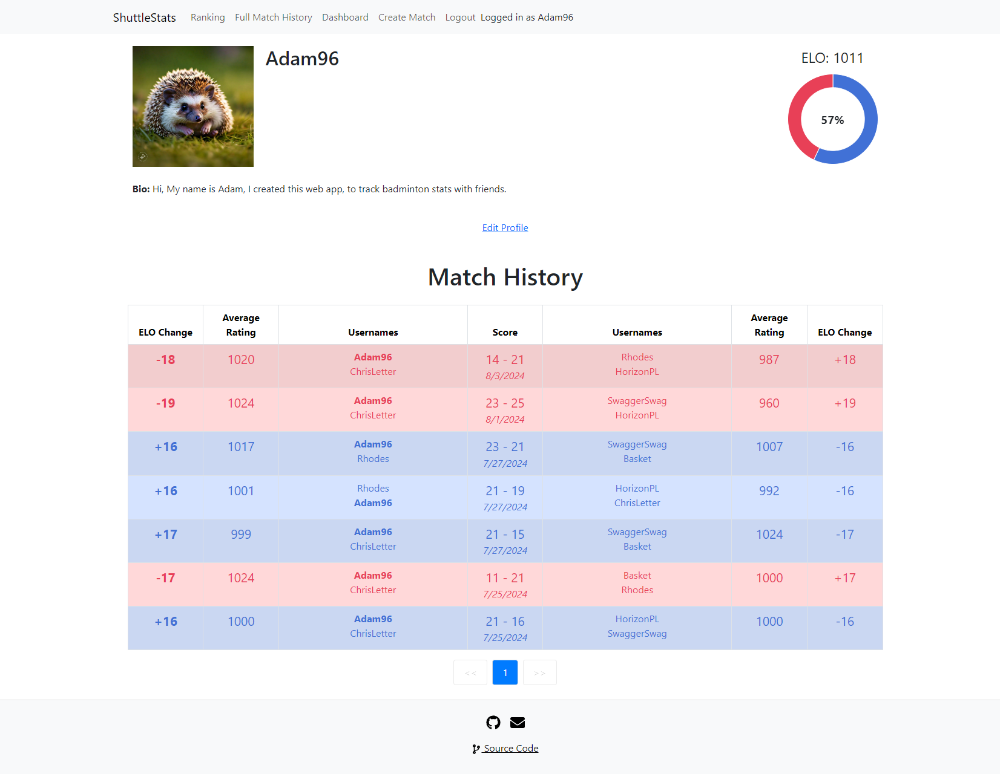
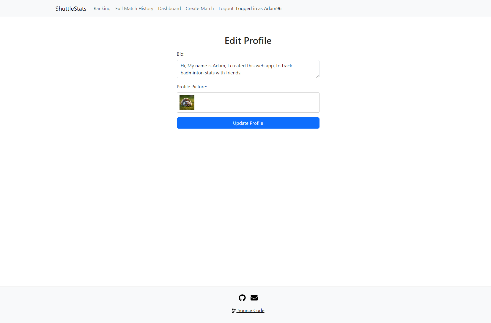
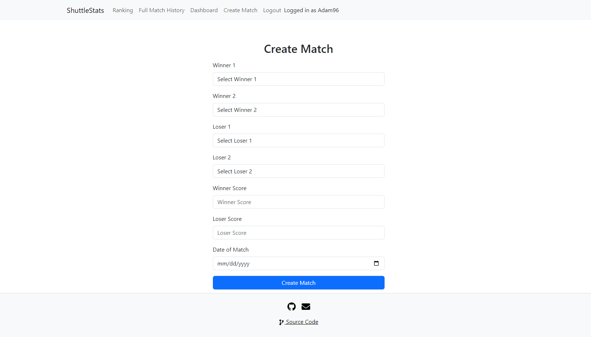
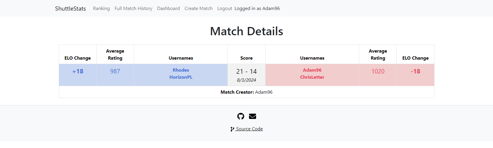
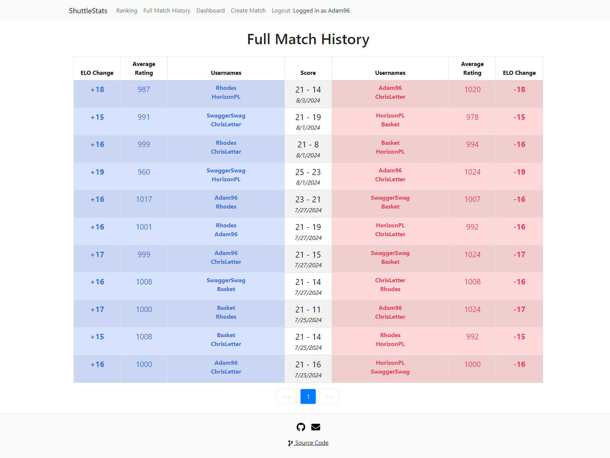
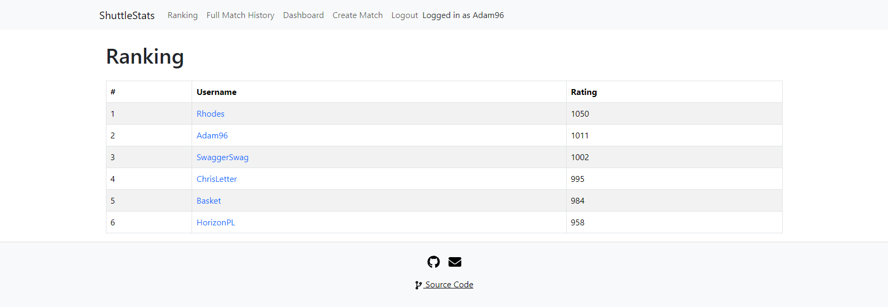

# 🏸📊 [ShuttleStats](https://shuttlestats.com/)

## Uptime ⏰

My Web application is available daily from **12 PM to 12 AM**.

📅 **Operating Hours**:
- 🌞 **12 PM** to 💤 **12 AM**

## Technology Stack and Features

- ⚡ [FastAPI](https://fastapi.tiangolo.com) for the Python backend API.
    - 🧰 [SQLAlchemy](https://www.sqlalchemy.org) for the Python SQL database interactions (ORM).
    - 🔍 [Pydantic](https://docs.pydantic.dev), used by FastAPI, for the data validation and settings management.
    - 💾 [PostgreSQL](https://www.postgresql.org) as the SQL database.
- ⚛️ [React](https://react.dev) for the frontend.
- 🐋 [Docker Compose](https://www.docker.com) for development and production.
- 🔒 Secure password hashing by default.
- 🔑 JWT (JSON Web Token) authentication.
- ☁️ [AWS EC2](https://aws.amazon.com/ec2/) Instance Launch

## Screenshots

### Home

### Login

### Register

### Dashboard

### Dashboard - Edit User

### Create Match

### Match Details

### Full Match History

### Ranking

